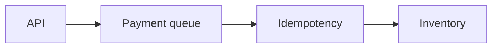

Replace this file with a real case. The diagram below only shows how a flow sits inside the page.

```mermaid
flowchart LR
  api[API] --> pay[Payment queue]
  pay --> ledger[Idempotency]
  ledger --> stock[Inventory]
```
