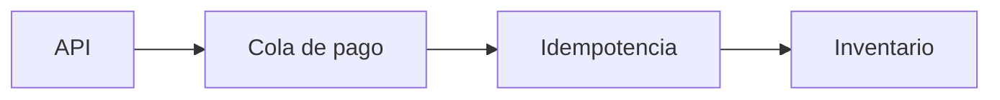

Sustituye este archivo por un caso tuyo. El diagrama de abajo es solo para enseñar cómo se ve un flujo dentro de la ficha.

```mermaid
flowchart LR
  api[API] --> pay[Cola de pago]
  pay --> ledger[Idempotencia]
  ledger --> stock[Inventario]
```
